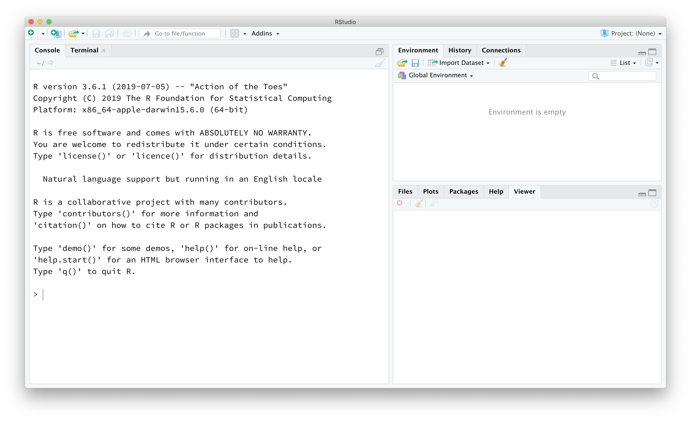

```{r global_options, include = FALSE}
knitr::opts_chunk$set(eval = TRUE, results = FALSE)
library(tidyverse)
library(openintro)
```

## RStudioインターフェース


このラボの目的は、RとRStudioを紹介することです。これらは、コース全体を通して、コースで議論される統計的概念を学習し、実際のデータを分析して情報に基づいた結論を導き出すために使用します。どちらがどちらかを明確にするために説明すると、`R`はプログラミング言語そのものの名前であり、RStudioは`R`を操作するための便利なインターフェースです。

実習が進むにつれて、指示された内容を超えて探索することをお勧めします。実験する意欲があれば、はるかに優れたプログラマーになれるでしょう！しかし、その段階に進む前に、`R`の基本的な流暢さを身につける必要があります。まず、`R`とRStudioの基本的な構成要素であるRStudioインターフェース、データの読み込み、および`R`でデータを操作するための基本的なコマンドについて探っていきます。

RStudioを起動してください。以下に示す画像のようなウィンドウが表示されるはずです。

```{r r-interface-2020, echo=FALSE, results="asis"}

```


左下のパネルは、アクションが行われる場所です。このパネルは「コンソール」と呼ばれます。RStudioを起動するたびに、コンソールの上部には、実行しているRのバージョンを示す同じテキストが表示されます。その情報の下には、`>`記号で示される「プロンプト」があります。その名前が示すように、このプロンプトは実際には要求、つまりコマンドの要求です。最初は、Rとの対話はコマンドを入力し、その出力を解釈することに尽きます。これらのコマンドとその構文は、文字通り何十年にもわたって進化し、現在では多くのユーザーがデータにアクセスし、統計計算を整理、記述、呼び出すためのかなり自然な方法だと感じています。

右上のパネルには、あなたの「環境」と、以前に入力したコマンドの履歴が含まれています。

右下のパネルには、プロジェクトフォルダー内の「ファイル」を閲覧したり、R関数の「ヘルプ」ファイルにアクセスしたり、R「パッケージ」をインストールおよび管理したり、視覚化を検査したりするためのタブがあります。デフォルトでは、作成したすべてのデータ視覚化は、それらを作成するために使用したコードのすぐ下に表示されます。プロットを「プロット」タブに表示させたい場合は、グローバルオプションを変更する必要があります。

### Rパッケージ


`R` はオープンソースのプログラミング言語であり、ユーザーがパッケージを提供して私たちの作業を容易にし、無料で利用できることを意味します。この演習、そして将来の多くの演習では、以下のパッケージを使用します。

-   **tidyverse** 「アンブレラ」パッケージ：データの前処理とデータ視覚化のための様々な `R` パッケージのスイートを内包しています。
-   **openintro** `R` パッケージ：OpenIntroリソースのデータとカスタム関数のため。

右下の「Packages」タブをクリックしてください。検索ボックスにこれらのパッケージ名（tidyverse、openintro）を入力して、インストールされているか確認してください。これらのパッケージが名前を入力しても表示されない場合は、RStudioセッションのコンソールに以下の2行のコードをコピー＆ペーストまたは入力してインストールしてください。各行のコードの後にEnter/Returnを押すようにしてください。

```{r install-packages, message = FALSE, eval = FALSE}
install.packages("tidyverse")
install.packages("openintro")
```


Enter/Returnを押すと、`R` が `R` をインストールしたときに選択した場所からパッケージをインストールするために実行しているプロセスを示すテキストのストリームが開始されます。`R` をインストールしたときにパッケージをダウンロードするサーバーを選択するよう求められなかった場合、RStudioはダウンロードするサーバーを選択するよう求めることがあります。どれを選択しても機能します。

パッケージを*インストール*する必要があるのは1回だけですが、RStudioを再起動するたびに*ロード*する必要があります。パッケージは `library` 関数を使用してロードします。tidyverseとopenintroパッケージを作業環境にロードするために、コンソールに以下の2行をコピー＆ペーストまたは入力してください。

```{r load-packages, message = FALSE}
library(tidyverse)
library(openintro)
```


tidyverseパッケージを使用することを選択したのは、データの読み込みからデータの整理、データの視覚化、データの分析まで、データ操作のさまざまな側面で必要となる一連のパッケージで構成されているためです。さらに、これらのパッケージは共通の哲学を共有しており、連携するように設計されています。tidyverseのパッケージの詳細については、[tidyverse.org](http://tidyverse.org/)をご覧ください。

### 再現可能なラボレポートの作成


再現可能な実験レポートを作成するためにR Markdownを使用します。その理由と方法を説明する以下のビデオをご覧ください。

[**実験レポートにR Markdownを使用する理由**](https://youtu.be/lNWVQ2oxNho) <iframe width="560" height="315" src="https://www.youtube.com/embed/lNWVQ2oxNho" frameborder="0" allowfullscreen></iframe>

[**RStudioで実験レポートにR Markdownを使用する**](https://youtu.be/o0h-eVABe9M) <iframe width="560" height="315" src="https://www.youtube.com/embed/o0h-eVABe9M" frameborder="0" allowfullscreen></iframe>

簡単に言うと、RStudioで「New File」->「R Markdown...」に進みます。次に、「From Template」を選択し、テンプレートのリストから「Lab Report for OpenIntro Statistics Lab 1」を選択します。

今後、コードをコンソールに直接入力することは控えてください。これは、参照したい出力を記憶し、再現することを非常に困難にするためです。R Markdownファイルの最も重要な機能は、`R`コードを記述されたレポート内にネストできることです。R Markdownファイルでは、`R`コードは「コードチャンク」と呼ばれる灰色のボックスに表示されます。R Markdownファイルは、灰色のボックスに`R`コードが含まれていることを、3つのバッククォート(``````)と、小文字のr({r})を含む2つの中括弧で始まることで認識します。これはすでに上記でご覧になっていますね！

`R`コードをコンソールに入力する代わりに、作成するすべてのコード（最終的な正解、または試しているもの）を、各問題に関連付けられた`R`コードチャンクに入力することをお勧めします。これらのコードチャンクに入力した`R`コードは、コンソールにコードを入力してEnter/Returnを押したのと同様に実行できます。コードチャンク内では、`R`コードの行を実行する方法が2つあります。(1)コードの行にカーソルを置き、同時に`Ctrl-Enter`または`Cmd-Enter`を押すか、(2)行にカーソルを置き、R Markdownファイルの右上隅にある「Run」ボタンを押します。あるいは、特定のコードチャンク内のすべての`R`コードを実行したい場合は、コードチャンクの右上隅にある「Play」ボタン（緑色の横向きの三角形）をクリックします。

特定のコードチャンクの前にすべてのコードチャンクを最初から実行する必要がある場合は、そのコードチャンクの右上隅にある「Fastforward」ボタン（バーの下に灰色の逆三角形）をクリックします。これにより、そのコードチャンクの*前に*発生したすべてのコードチャンクが実行されますが、そのコードチャンクに含まれる`R`コードは*実行されません*。

## アーバスノット博士の洗礼記録


始めるにあたり、データを見てみましょう。

```{r load-abrbuthnot-data}
arbuthnot
```


繰り返しになりますが、上記のコードは以下の方法で実行できます。

-   カーソルを行に置いて `Ctrl-Enter` または `Cmd-Enter` を押す
-   カーソルを行に置いて、R Markdownファイルの右上隅にある「Run」ボタンを押す
-   コードチャンクの右上隅にある緑色の矢印をクリックする

このコードチャンクに含まれる1行のコードは、`R`にデータ（Arbuthnotの男児と女児の洗礼数）を読み込むよう指示します。RStudioウィンドウの右上隅にある「Environment」タブに、3つの変数に対して82の観測値を持つ`arbuthnot`というデータセットが表示されるはずです。`R`を操作する際、様々な目的のためにオブジェクトを作成します。ここでは、パッケージを読み込むことでワークスペースにオブジェクトを読み込みましたが、計算処理の副産物として、実行した分析のために、または作成した視覚化のために、自分でオブジェクトを作成することもあります。

Arbuthnotデータセットは、18世紀の医師、作家、数学者であるジョン・アーバスノット博士の研究に言及しています。彼は新生児の男児と女児の比率に関心があり、1629年から1710年までの毎年、ロンドンで生まれた子供たちの洗礼記録を収集しました。もう一度言いますが、以下のコードを実行するか、データセットの名前をコンソールに入力することでデータを表示できます。スペルと大文字・小文字の区別に注意してください！`R`は大文字・小文字を区別するため、誤って`Arbuthnot`と入力すると、`R`はオブジェクトが見つからないと表示します。

```{r view-data}
arbuthnot
```


このコマンドはデータを表示しますが、データセット全体をコンソールに表示することはあまり有用ではありません。RStudioの利点の1つは、組み込みのデータビューアが付属していることです。*Environment*タブ（右上ペイン）には、環境内のオブジェクトが一覧表示されます。`arbuthnot`の名前をクリックすると、R Markdownファイルの隣に*Data Viewer*タブが開き、データセットの別の表示が提供されます。この表示は、Excelでデータを表示するのと似ており、データセットをスクロールして検査することができます。ただし、Excelとは異なり、このタブでデータを編集することは**できません**。データの表示が終了したら、左上隅の`x`をクリックしてこのタブを閉じることができます。

データを検査すると、4列の数値と82行が表示されます。各行は、Arbuthnotがデータを収集した異なる年を表しています。各行の最初の項目は行番号（必要に応じて個々の年のデータにアクセスするために使用できるインデックス）、2番目は年、3番目と4番目はその年に洗礼を受けた男の子と女の子の数です。コンソールウィンドウの右側にあるスクロールバーを使用して、完全なデータセットを調べます。

最初の列の行番号はArbuthnotのデータの一部ではないことに注意してください。`R`は、視覚的な比較を容易にするために、出力の一部としてこれらの行番号を追加します。これらは、スプレッドシートの左側にあるインデックスと考えることができます。実際、データをスプレッドシートと比較することは一般的に役立ちます。`R`はArbuthnotのデータを、`R`が*データフレーム*と呼ぶスプレッドシートまたはテーブルに保存しています。

このデータフレームの次元、変数の名前、および最初のいくつかの観測値は、以下に示すように、データセットの名前を`glimpse()`関数に挿入することで確認できます。

```{r glimpse-data}
glimpse(arbuthnot)
```


以前は、すべての `R` コードをコードチャンクに入力するのがベストプラクティスであると述べましたが、このコマンドはコンソールに入力する方がより良いプラクティスです。一般的に、ソリューションに必要なすべてのコードはコードチャンクに入力する必要があります。このコマンドはデータを探索するために使用されるため、ソリューションコードには必要なく、ソリューションファイルに含めるべきではありません。

このコマンドは以下を出力するはずです。

```{r glimpse-data-result, echo=FALSE, results = TRUE}
glimpse(arbuthnot)
```


このデータセットには82の観測値と3つの変数があることがわかります。変数名は `year`、`boys`、`girls` です。この時点で、`R` の多くのコマンドが数学の授業で習う関数とよく似ていることに気づくかもしれません。つまり、`R` コマンドを呼び出すということは、関数にいくつかの入力（引数と呼ばれるもの）を提供し、関数がそれらを使用して出力を生成するということです。例えば、`glimpse()` コマンドは、データフレームの名前という1つの引数を取り、データセットの表示を出力として生成しました。

## データ探索


データをもう少し詳しく見ていきましょう。データフレームの単一の列には、`$` を使って列を抽出することでアクセスできます。例えば、以下のコードは `arbuthnot` データフレームから `boys` 列を抽出します。

```{r view-boys}
arbuthnot$boys
```


このコマンドは、毎年洗礼を受けた男の子の数のみを表示します。`R`は`$`を「私の前に来るデータフレームに行き、私の後に来る変数を見つけなさい」と解釈します。

1.  洗礼を受けた女の子の数だけを抽出するには、どのようなコマンドを使用しますか？コンソールで試してみてください！

`R`がこれらのデータを表示する方法が異なることに注意してください。完全なデータフレームを見たとき、表示の各行に1つずつ、82行がありました。これらのデータはデータフレームから抽出されているため、他の変数と一緒にテーブルとして構造化されていません。代わりに、これらのデータは次々と表示されます。このように表示されるオブジェクトは*ベクトル*と呼ばれます。数学の授業で見たベクトルと同様に、ベクトルは数値のリストを表します。`R`は、各エントリがベクトル内のどこにあるかを示すために、表示の左側に[角括弧]で囲まれた数字を追加しています。たとえば、5218は`[1]`の後に続き、`5218`がベクトルの最初のエントリであることを示しています。行の先頭に`[43]`が表示されている場合、その行に表示される最初の数値がそのベクトルの43番目のエントリに対応することを示します。

### データ視覚化


`R` には、グラフィックを作成するための強力な関数がいくつかあります。以下のコードで、年間の女児の洗礼数を簡単にプロットできます。

```{r plot-girls-vs-year}
ggplot(data = arbuthnot, aes(x = year, y = girls)) + 
  geom_point()
```


このコードでは、`ggplot()` 関数を使用してプロットを作成します。このコードチャンクを実行すると、コードチャンクの下にプロットが表示されます。R Markdownドキュメントは、最終レポートでプロットがどのように表示されるかのイメージを掴めるように、プロットを生成するために使用されたコードの下にプロットを表示します。

上記のコマンドは、数学的な関数にも似ています。ただし、今回は複数の入力（引数）が必要で、それらはコンマで区切られています。

`ggplot()`では:

-   最初の引数は常に、プロットに使用するデータセットの名前です。
-   次に、データセットから、x軸やy軸など、プロットの異なる`aes`thetic要素に割り当てる変数を指定します。

これらのコマンドは、x軸とy軸に割り当てた変数を含む空白のプロットを作成します。次に、`ggplot()`に、その空白のテンプレートにどのような種類の視覚化を追加したいかを伝える必要があります。`ggplot()`に別のレイヤーを追加するには、次の手順を実行します。

-   レイヤーを追加することを示すために、行の最後に`+`を追加します。
-   次に、プロットの作成に使用する`geom`etricオブジェクトを指定します。

散布図を作成したいので、`geom_point()`を使用します。これは、`ggplot()`に対し、各データポイントをプロット上の1つの点で表すように指示します。上記のプロットを散布図の代わりに折れ線グラフで視覚化したい場合は、`geom_point()`を`geom_line()`に置き換えます。これは、`ggplot()`に対し、各観測値から次の観測値へ（順次）線を描画するように指示します。

```{r plot-girls-vs-year-line}
ggplot(data = arbuthnot, aes(x = year, y = girls)) +
  geom_line()
```


グラフを使用して、次の質問に答えてください。

1.  長年にわたる女児の洗礼数に明らかな傾向はありますか？どのように説明しますか？（ラボレポートを包括的なものにするために、プロットを作成するために必要なコードと書面による解釈を必ず含めてください。）

`ggplot()` 関数の構文をどのように知るべきか疑問に思うかもしれません。幸いなことに、`R` はすべての関数を広範囲に文書化しています。関数の機能と使用方法（例：関数の引数）を知るには、コンソールに関数名の前に疑問符を入力するだけです。コンソールに次のように入力してください。

```{r plot-help, tidy = FALSE}
?ggplot
```


ヘルプファイルが前面に表示され、右下のパネルのプロットに置き換わることに注目してください。タブの名前をクリックすることで、タブを切り替えることができます。

### 大きな電卓としてのR


さて、洗礼の総数をプロットしたいとします。これを計算するには、`R`を大きな電卓として使用できるという事実を利用できます。これを行うには、以下の計算のような数式をコンソールに入力します。

```{r calc-total-bapt-numbers}
5218 + 4683
```


この計算は、1629年の洗礼の総数を提供します。この計算を毎年繰り返すことができます。これはおそらく時間がかかりますが、幸いなことに、より速い方法があります！男の子の洗礼数のベクトルに女の子の洗礼数のベクトルを追加すると、`R`はこれらの合計を同時に計算できます。

```{r calc-total-bapt-vars}
arbuthnot$boys + arbuthnot$girls
```


表示されるのは82個の数字のリストです。データフレームではなくベクトルで作業しているため、これらの数字はリストとして表示されます。それぞれの数字は、その年に洗礼を受けた男の子と女の子の合計数を表します。計算が正しいかどうかを確認するために、`boys`と`girls`列の最初の数行を見てみましょう。

### データフレームへの新しい変数の追加


この新しい洗礼総数のベクトルを使用していくつかのプロットを生成することに関心があるので、これをデータフレームの永続的な列として保存したいと考えます。これは以下のコードを使用して行うことができます。

```{r calc-total-bapt-vars-save}
arbuthnot <- arbuthnot |>
  mutate(total = boys + girls)
```


このコードには多くの新しい要素が含まれているので、分解して説明しましょう。最初の行では2つのことを行っています。(1) この更新されたデータフレームに新しい`total`列を追加し、(2) 既存の`arbuthnot`データフレームを、新しい`total`列を含む更新されたデータフレームで上書きします。これらの2つのプロセスは、**パイプ** (`|>`) 演算子を使用して連結できます。パイプ演算子は、前の式の出力を受け取り、それを次の式の最初の引数として「パイプ」します。
（ここではRに組み込まれているパイプを使用していることに注意してください。同様の機能を持つ別のパイプ演算子 (`%>%`) もあります。）

数式との類推を続けると、`x |> f(y)`は`f(x, y)`と同等です。`arbuthnot`と`mutate(total = boys + girls)`をパイプ演算子で接続することは、`mutate(arbuthnot, total = boys + girls)`と入力するのと同じで、`arbuthnot`が`mutate()`関数の最初の引数になります。

::: {#boxedtext}
**パイプに関する注意:** この2行のコードは次のように読むことができます。

*"`arbuthnot`データセットを取り、それを`mutate`関数に**パイプ**します。`boys`と`girls`という変数の合計である`total`という新しい変数を作成することで、`arbuthnot`データセットを変更します。そして、結果のデータセットを`arbuthnot`というオブジェクトに割り当てます。つまり、古い`arbuthnot`データセットを新しい変数を含む新しいデータセットで上書きします。"*

これは、各行を調べてその年の`boys`と`girls`の数を合計し、その値を`total`という新しい列に記録するのと同等です。
:::

<div>

**新しい変数はどこに？** データセット内の変数を変更した場合は、データビューアでデータセットの名前を再度クリックして更新してください。

</div>


これでデータフレームに`total`という新しい列が追加されたことがわかります。特殊な記号`<-`は*代入*を実行し、パイプ演算の結果を受け取り、それを環境内のオブジェクトに保存します。この場合、環境にはすでに`arbuthnot`というオブジェクトがあるので、このコマンドは新しい変更された列でそのデータセットを更新します。

以下のコードで、年間の洗礼総数の折れ線グラフを作成できます。

```{r plot-total-vs-year}
ggplot(data = arbuthnot, aes(x = year, y = total)) + 
  geom_line()
```


同様に、1629年の男の子と女の子の洗礼総数がわかれば、以下のコードで男の子の数と女の子の数の比率を計算できます。

```{r calc-prop-boys-to-girls-numbers}
5218 / 4683
```


あるいは、完全な`boys`と`girls`列に作用させることで、毎年この比率を計算し、その計算結果を`boy_to_girl_ratio`という新しい変数として保存することもできます。

```{r calc-prop-boys-to-girls-vars}
arbuthnot <- arbuthnot |>
  mutate(boy_to_girl_ratio = boys / girls)
```


また、1629年に生まれた男の子の割合を以下のコードで計算できます。

```{r calc-prop-boys-numbers}
5218 / (5218 + 4683)
```


または、これをすべての年で同時に計算し、新しい変数`boy_ratio`としてデータセットに追加することもできます。

```{r calc-prop-boys-vars}
arbuthnot <- arbuthnot |>
  mutate(boy_ratio = boys / total)
```


`boys + girls`で割るのではなく、以前に作成した`total`変数を使用していることに注目してください！

3.  次に、長年にわたる男の子の割合のプロットを生成します。何が見えますか？

<div>

**ヒント:** コンソールで上下の矢印キーを使用すると、以前のコマンド、いわゆるコマンド履歴をスクロールできます。また、右上パネルの履歴タブをクリックしてコマンド履歴にアクセスすることもできます。これにより、今後多くの入力作業を省くことができます。

</div>


最後に、減算や除算のような単純な数学演算子に加えて、Rに`>`（より大きい）、`<`（より小さい）、`==`（等しい）のような比較をさせることができます。たとえば、以下のコードを使用して、各年の男の子の出生数が女の子の出生数を上回ったかどうかを示す`more_boys`という新しい変数を作成できます。

```{r boys-more-than-girls}
arbuthnot <- arbuthnot |>
  mutate(more_boys = boys > girls)
```


このコマンドは、`arbuthnot`データフレームに新しい変数を追加します。この変数には、その年に男の子が女の子より多かった場合は`TRUE`、そうでなかった場合は`FALSE`の値が含まれます（答えはあなたを驚かせるかもしれません）。この変数は、これまで遭遇したものとは異なる種類のデータを含んでいます。`arbuthnot`データフレームの他のすべての列には数値（年、男の子と女の子の数）があります。ここでは、Rに*論理*データ、つまり値が`TRUE`または`FALSE`であるデータを作成するように要求しました。一般に、データ分析にはさまざまな種類のデータタイプが関与し、`R`を使用する理由の1つは、それらの多くを表現および計算できることです。

## さらなる演習


前の数ページでは、アーバスノットの洗礼データの一部を再作成し、予備的な分析を行いました。あなたの課題は、これらのステップを繰り返すことですが、現在は米国の出生記録を対象とします。データは`present`というデータフレームに保存されています。

列の最小値と最大値を見つけるには、`summarize()`呼び出し内で`min()`関数と`max()`関数を使用できます。これについては、次のラボで詳しく学びます。

以下は、ある年の男児出生数の最小値と最大値を見つける方法の例です。

```{r summarize min and max}
arbuthnot |>
  summarize(min = min(boys),
            max = max(boys)
            )
```


`present`データフレームを使用して次の質問に答えてください。

1.  このデータセットには何年間のデータが含まれていますか？データフレームの次元は何ですか？変数（列）名は何ですか？

2.  これらの数値はアーバスノットの数値とどのように比較されますか？同様の規模ですか？

3.  時間の経過とともに生まれた男の子の割合を示すプロットを作成します。何が見えますか？男の子が女の子よりも高い割合で生まれるというアーバスノットの観察は、米国でも当てはまりますか？プロットとあなたの回答を含めてください。*ヒント：*上記の演習3のコードを再利用できるはずです。データフレームの名前を置き換えるだけです。

4.  米国で総出生数が最も多かったのは何年ですか？*ヒント：*まず合計を計算し、新しい変数として保存します。次に、`total`列に基づいてデータセットを降順にソートします。これは、データビューアで変数名の横にある矢印をクリックすることで対話的に行うことができます。ソートされた結果をレポートに含めるには、2つの新しい関数を使用する必要があります。まず、変数をソートするために`arrange()`を使用します。次に、降順にするために別の関数`desc()`を使用します。サンプルコードを以下に示します。

```{r sample-arrange, eval=FALSE}
present |>
  arrange(desc(total))
```


これらのデータは、疾病対策センターの報告書から来ています。`?present`コマンドを使用してヘルプファイルを表示することで、詳細を知ることができます。

## R学習とRStudioでの作業のためのリソース


これはRとRStudioへの短い導入でしたが、コースが進むにつれて、より多くの機能とより完全な言語の理解を提供します。

このコースでは、**tidyverse**のRパッケージスイートを使用します。GrolemundとWickhamによる書籍[R For Data Science](https://r4ds.had.co.nz/)は、tidyverseを使用したRでのデータ分析に最適なリソースです。RコードをGoogleで検索する場合は、検索クエリにこれらのパッケージ名も必ず含めてください。たとえば、「Rでの散布図」とGoogle検索する代わりに、「tidyverseを使用したRでの散布図」と検索します。

これらは学期を通して役立つかもしれません。

-   [RMarkdownチートシート](https://github.com/rstudio/cheatsheets/raw/main/rmarkdown-2.0.pdf)
-   [データ変換チートシート](https://github.com/rstudio/cheatsheets/raw/main/data-transformation.pdf)
-   [データ可視化チートシート](https://github.com/rstudio/cheatsheets/raw/main/data-visualization-2.1.pdf)


これらのチートシートの一部のコードは、このコースでは高度すぎる場合があります。しかし、その大部分は学期を通して役立つでしょう。

------------------------------------------------------------------------

<a rel="license" href="http://creativecommons.org/licenses/by-sa/4.0/">{style="border-width:0"}</a><br />この作品は、<a rel="license" href="http://creativecommons.org/licenses/by-sa/4.0/">クリエイティブ・コモンズ 表示 - 継承 4.0 国際ライセンス</a>の下に提供されています。
